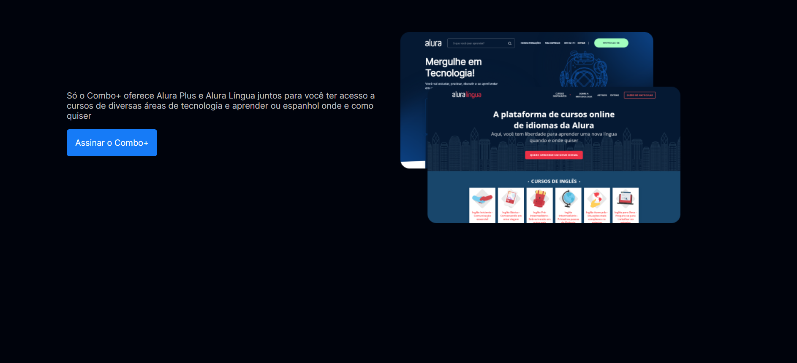
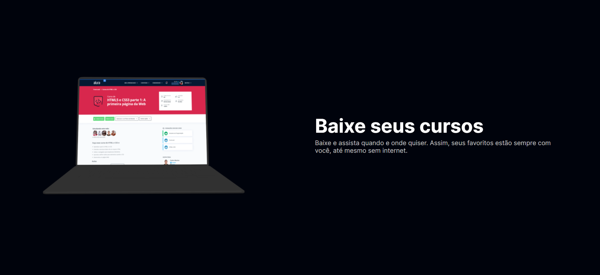
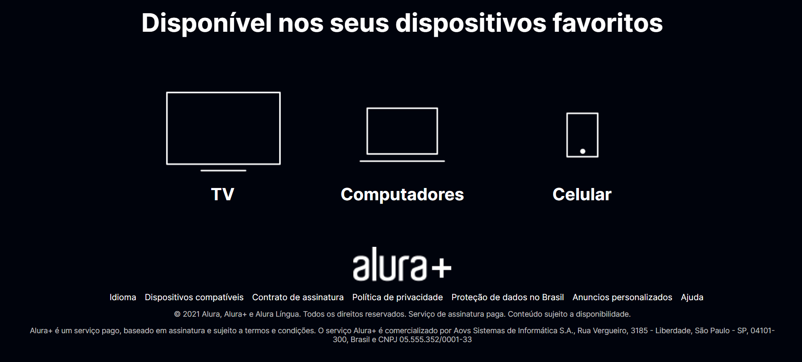

<h1 align="center">

</h1>

     <h3>Este projeto se trata de um site de cursos da alura, ele foi construído utilizando HTML5 e CSS3📲.</h3>
    
    

###

# 🔨 Tecnologias

💻 HTML / CSS

###

# 📸 Veja:
https://mrr4ngel.github.io/AluraPlus/

